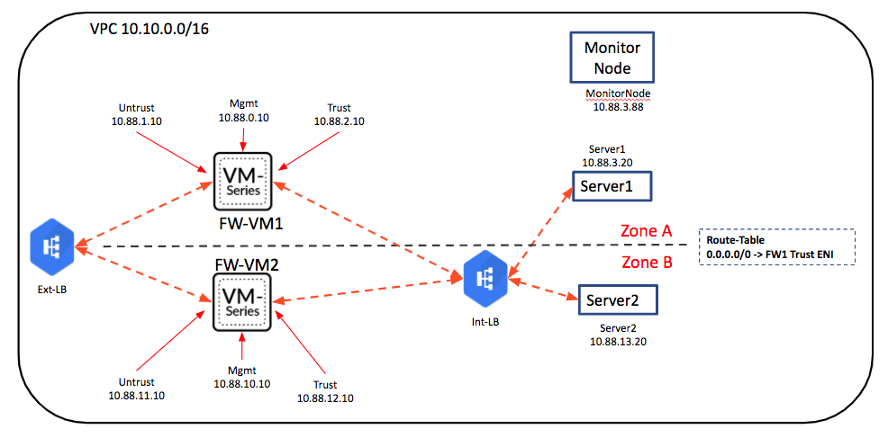

# Alicloud Load-balancer Sandwich Architecture
This template deploys two VM-Series firewalls in a Load-Balancer Sandwich architecture in Alibaba Cloud using the VM-Series (10.0.3 or 11.0.0) images on Alibaba Cloud Marketplace. The deployed ennvironment is as shown in the diagram below:

This demo environment will allow you to showcase securing of Inbound and Outbound traffic. Pre-built configurations for both FWs will be uploaded to both VM-Series firewalls. A script (from Kambiz Kazemi) on the Monitor Node is used to check the availability of FW1 for outbound traffic. If FW1 is down, the script will update the route table to point the default route to FW2.

## Prequisites:
- Terraform 
- Python 3.8
- Install python modules
  - pip3 install --upgrade -r requirements.txt
- Alicloud key-pair
  - https://www.alibabacloud.com/help/doc-detail/51793.htm
- Optional: Auth_code for BYOL license for VM-Series

## Notes
- Check and ensure that the instance types are available in the Alicloud region/zones that you are using for both VM-Series and the Linux servers. Usually it should be fine using "g5" family instances.
- The HA script on the Monitor node is hosted on a storage bucket on Alicloud. Access to github is sometimes denied from Alicloud regions in China.
- The "admin" password for the VM-Series after the sample config is committed is "PaloAlt0123". Please change the password as soon as the VM-Series comes online.
- The VM-Series Marketplace image must use one of these instance families: g5, sn2, sn2ne
- Not all Alicloud regions support DPDK. Please, make sure it's disabled when deploying in those zones or the Ethernet interfaces will not come up (`set system setting dpdk-pkt-io off`)

## Deployment

1. Update the "terraform.tfvars" file with the necessary information.
   - "access_key", "secret_key" and "region" are mandatory.
   - "key_name" is the Alicloud key-pair used for logging into the VM-Series firewalls. It is mandatory.
   - "ssh_key_path" is the full path to the private key associated with the above-mentioned Alicloud key-pair. It is mandatory.
   - You can use the default values for the rest.
   - "linux_password" is the password for the linux instances, and also the temporary password used when the VM-Series admin passowrd is set upon first login. Please ensure it satisfies the complex password requirements for VM-Series.
   - If you want to bootstrap the VM-Series firewall and license the firewalls, set "bootstrap" to yes, and provide a valid auth_code to license both firewalls.
   - "pan_os_version". Either 10.0.3 or 11.0.0. Default 11.0.0. If 

2. Run "terraform init"

3. Run "terraform apply"

4. Demo environment will be deployed. It takes about 15-20 minutes for the environment to be fully ready.

5. Access to the various resources will be shown in the terraform outputs.

## Removing The Demo Environment

0. (Only if you licensed the firewalls) De-license the firewalls
1. Run "terraform destroy"

## Support Policy
The code and templates in the repo are released under an as-is, best effort,
support policy. These scripts should be seen as community supported and
Palo Alto Networks will contribute our expertise as and when possible.
We do not provide technical support or help in using or troubleshooting the
components of the project through our normal support options such as
Palo Alto Networks support teams, or ASC (Authorized Support Centers)
partners and backline support options. The underlying product used
(the VM-Series firewall) by the scripts or templates are still supported,
but the support is only for the product functionality and not for help in
deploying or using the template or script itself. Unless explicitly tagged,
all projects or work posted in our GitHub repository
(at https://github.com/PaloAltoNetworks) or sites other than our official
Downloads page on https://support.paloaltonetworks.com are provided under
the best effort policy.
